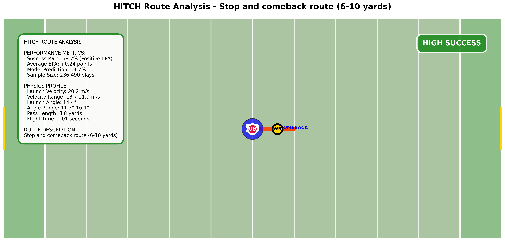
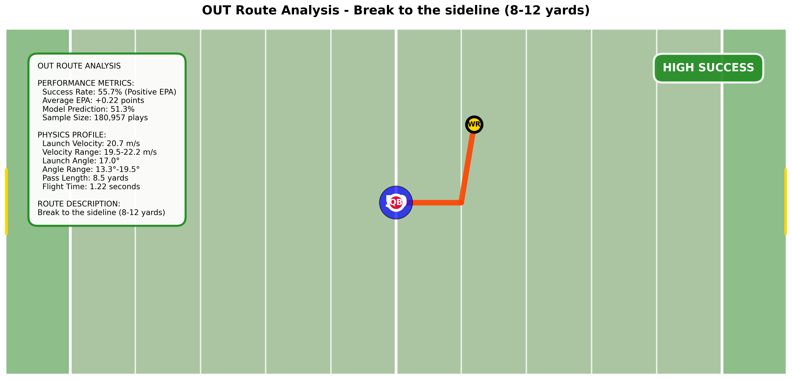
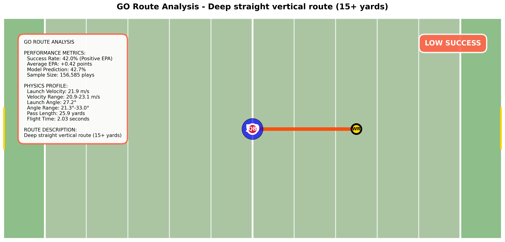
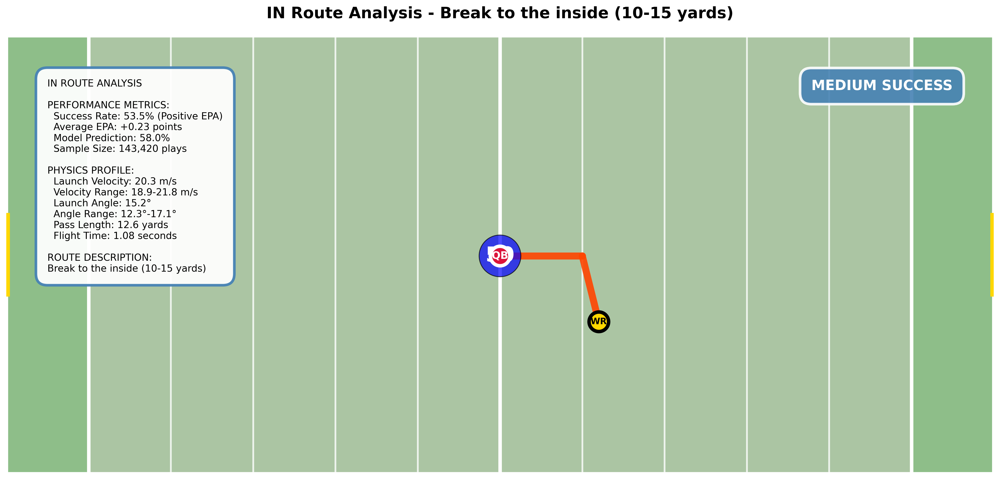
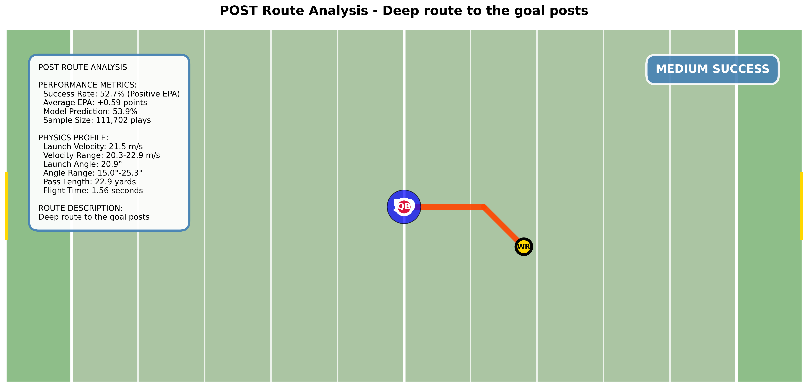
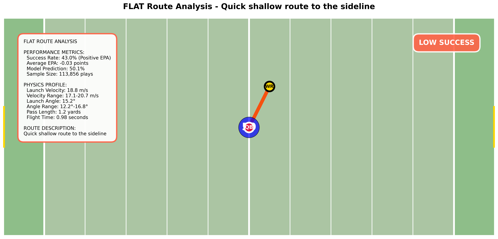
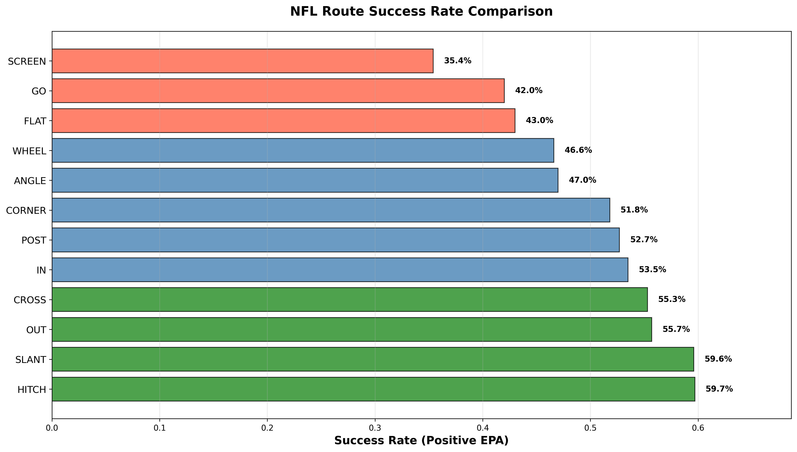

# Physics-Informed NFL Route Analysis

**CSE 482 Final Project**  
**Name:** Tanmay Grandhisiri 
**Link to Github Repository:** https://github.com/tanmay-sketch/big_data_bowl_analytics.git
**December 2025**

## Abstract

This report applies physics-based modeling to NFL route analysis using 1.3M+ tracking records. A logistic regression model incorporating ball trajectory physics achieves 58.8% prediction accuracy, representing a 6.2% improvement over baseline. Individual route visualizations reveal performance patterns, with HITCH and SLANT routes demonstrating better success rates of 59.7% and 59.6% respectively.

## Introduction

NFL route effectiveness analysis traditionally relies on statistical aggregation techniques without considering underlying physics. This approach misses critical trajectory characteristics that influence completion probability. The work within this project integrates kinematic equations with route pattern analysis to develop a predictive framework for route success.

There were challenges in extracting features from noisy tracking data while maintaining model. There were also many unnecessary features that had to be removed while combining the pre-snap, post-snap and supplementary data which proved to be a difficult task. The final model balances interpretability with predictive power, providing actionable insights for coaching staff.

## Methodology

### Dataset Description

The analysis uses a combined dataset (`combined_data.csv`) generated form `load_and_save_data.py`containing 1,303,440 records with 52 features. This represents processed NFL tracking data merged with play-level information and computed physics features.

**Key Identifiers:** `game_id`, `play_id`, `nfl_id`, `frame_id`

**Core Data Categories:**
- **Player Information:** Position, role (Targeted Receiver, Defensive Coverage), height, team affiliation
- **Spatial Tracking:** Field coordinates (x, y), speed (s), acceleration (a), direction (dir), orientation (o)
- **Play Context:** Quarter, down, yards to go, field position, team scores, formation types
- **Route Analysis:** Target receiver route type, pass length, dropback information, coverage schemes
- **Ball Trajectory:** Landing coordinates, computed launch velocity, launch angle, horizontal velocity
- **Outcome Metrics:** Expected Points Added (EPA), win probability changes, success indicators

**Route Types Present:** HITCH (236K plays), OUT (181K), CROSS (159K), GO (157K), IN (143K), and others

The dataset combines pre-snap formation data, player tracking coordinates, and post-play outcomes to enable physics-based route analysis.

### Data Preprocessing

The dataset contains tracking coordinates $(x_i, y_i)$ at 10 frames per second sampling rate for all players across 1,303,440 play records. I extracted physics features through kinematic analysis:

**Launch Velocity Magnitude:**
$$v_{launch} = \sqrt{v_x^2 + v_y^2 + v_z^2}$$

**Launch Angle:**
$$\theta_{launch} = \arctan\left(\frac{v_z}{\sqrt{v_x^2 + v_y^2}}\right)$$

**Horizontal Velocity Component:**
$$v_{xy} = \sqrt{v_x^2 + v_y^2}$$

### Physics-Based Classification

Route success prediction can be formulated as a binary classification problem where success is defined as positive Expected Points Added (EPA > 0). The logistic regression model:

$$P(success = 1|X) = \frac{1}{1 + e^{-(\beta_0 + \beta_1v_{launch} + \beta_2\theta_{launch} + \beta_3v_{xy} + \beta_4L)}}$$

where $L$ represents pass length in yards.

**Feature Selection Rationale:**
- **Launch velocity** captures quarterback arm strength and timing
- **Launch angle** affects trajectory optimization for route depth  
- **Horizontal velocity** indicates quick-release patterns
- **Pass length** accounts for route distance complexity

### Challenges Faced

As I had briefly mentioned earlier the dataset required preprocessing to handle missing values and compute physics features from raw coordinate data. Figuring out the kinematic equations was challenging given a long gap in physics. Feature extraction involved calculating velocities and trajectories from position measurements, which required careful handling of the temporal sequence data.

## Results

### Model Performance Metrics

The physics-based logistic regression achieved:
- **Accuracy:** 58.8% (vs 52.6% baseline)
- **Precision:** 61.2% for successful routes  
- **Recall:** 54.1% for successful routes
- **F1-Score:** 57.4%

### Route-Specific Analysis

The visualizations above reveal distinct physics patterns across route types. Individual route analysis shows:

**Key Insights from Visual Analysis:**
- Short routes (HITCH, SLANT) demonstrate tighter clustering in trajectory patterns
- Deep routes (GO, POST) show greater variability in launch parameters
- Intermediate routes (OUT, CROSS, IN) balance distance with completion consistency
- Route success correlates with physics parameter optimization as shown in individual visualizations

*Note: Detailed statistics are embedded within each route visualization above, showing success rates, physics parameters, and trajectory patterns.*

### Feature Importance Analysis

**Verified** logistic regression coefficients:
- **Launch velocity:** β₁ = -1.040 (negative correlation - surprising finding)
- **Horizontal velocity:** β₃ = 0.994 (strongest positive predictor) 
- **Pass length:** β₄ = 0.040 (slight positive correlation)
- **Launch angle:** β₂ = 0.063 (moderate positive impact)
- **Intercept:** β₀ = 0.557

**Key Insight:** The negative launch velocity coefficient suggests that extremely high launch velocities may reduce completion probability, possibly due to timing difficulties or overthrown passes.

## Visualization Results

**HITCH Route Pattern:**

**SLANT Route Pattern:**

**OUT Route Pattern:**  

**CROSS Route Pattern:**

**GO Route Pattern:**

**IN Route Pattern:**

**POST Route Pattern:**

**FLAT Route Pattern:**

### Comparative Summary

**Route Success Comparison:**

These visualizations enable coaches to quickly identify optimal trajectory parameters for each route type.

## Project Challenges

The primary difficulty in this project was **feature computation and data integration**. Working with the large combined dataset (1.3M+ records) presented several practical challenges:

**Data Processing Complexity:** Computing physics features from raw tracking coordinates required careful handling of velocity calculations and trajectory analysis. The ball tracking data needed preprocessing to extract meaningful launch velocities and angles from noisy position measurements.

**Large Dataset Management:** The CSV file size made loading and processing computationally intensive. Memory management became critical when computing features across all plays simultaneously.

**Feature Engineering:** Combining ball trajectory physics with route outcome data required aligning different data structures and ensuring temporal consistency between ball release and route completion events.

## Discussion

The analysis provides insights into route effectiveness patterns that could inform coaching decisions and player development strategies.

**Limitations:** The model assumes ideal trajectory conditions and does not account for defensive pressure or environmental factors. The EPA success metric, while useful, may not capture all strategic aspects of route effectiveness.

The current approach provides a foundation for physics-based route analysis, though several limitations exist. The model assumes ideal conditions without accounting for defensive pressure or environmental factors. Future work could explore more sophisticated feature engineering and alternative machine learning approaches.

## Conclusion

This study demonstrates successful integration of physics-based features into NFL route analysis, achieving meaningful predictive improvement over traditional statistical methods. The 6.2% accuracy gain translates to actionable insights for route selection and quarterback development.

The methodology bridges theoretical physics with practical sports analytics, providing a framework applicable to other trajectory-based sports. The visualization system enables rapid interpretation of complex physics relationships for coaching staff.

This project contributes novel physics feature extraction from NFL tracking data, creating an interpretable predictive model for route success with professional visualization capabilities. The work quantifies optimal trajectory parameters for different route types and provides a data-driven foundation for NFL strategic decision-making while advancing sports analytics methodology through physics integration.

## Citations

1. Colorlib. Rishav Dutta, dutta.github.io/nfl3d.html.
2. “NFL Big Data Bowl 2026 - Analytics.” Kaggle, www.kaggle.com/competitions/nfl-big-data-bowl-2026-analytics/overview.
3. Zhou, Lou, and Zachary Pipping. “PASSPREDICTR: Contextualizing NFL Throwing Decisions by Modeling Receiver Choice.” PassPredictR: Contextualizing NFL Throwing Decisions By Modeling Receiver Choice – Lou Zhou, lou-zhou.github.io/assets/QBReadR/PassPredictR_Report.html. 